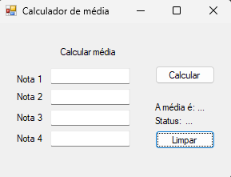

# 📊 Calculadora de Média Escolar

Este é um programa simples desenvolvido em .NET Framework usando Windows Forms, que calcula a média de quatro notas inseridas pelo usuário e indica se o aluno foi "Aprovado" ou "Reprovado" com base na média.

## ✨ Funcionalidades
- 📥 **Entrada de Notas:** O usuário insere quatro notas no formulário.
- ➕ **Cálculo da Média:** Ao clicar no botão "Calcular", o programa soma as notas, calcula a média e exibe o resultado.
- 🎓 **Resultado de Aprovação:** A média calculada é comparada com o valor mínimo de aprovação de 6. Se a média for maior ou igual a 6, o aluno é aprovado; caso contrário, é reprovado.
- ♻️ **Botão de Limpar:** Permite limpar todos os campos de entrada e os resultados exibidos.

## 💻 Exemplo de Uso
Após inserir as quatro notas e clicar em "Calcular", o programa exibe a média e o status do aluno (Aprovado/Reprovado). Um botão de "Limpar" permite resetar os campos para uma nova entrada de dados.

## 📸 Captura de Tela
Aqui está uma captura de tela do programa em execução:

## 🚀 Como Executar
1. 🖥️ Certifique-se de que você está em um ambiente Windows.
2. ⬇️ Baixe o arquivo `CalcMedia.exe` disponível no repositório.
3. 📂 Dê um duplo clique no arquivo `CalcMedia.exe` para iniciar o programa.

Pronto! Agora, você pode inserir as notas, calcular a média e visualizar o resultado de aprovação ou reprovação. 🎉